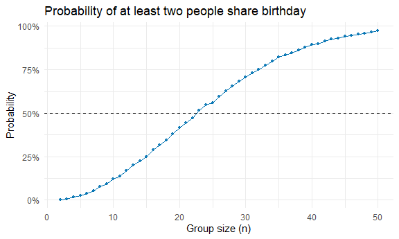
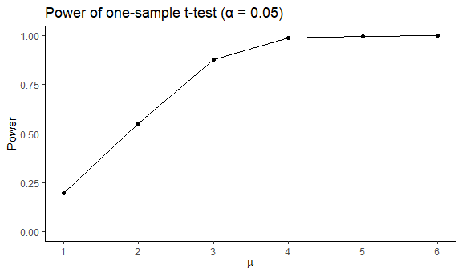
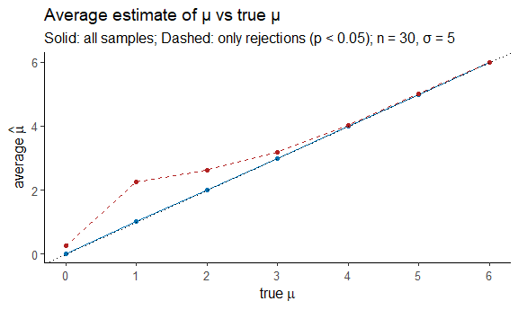
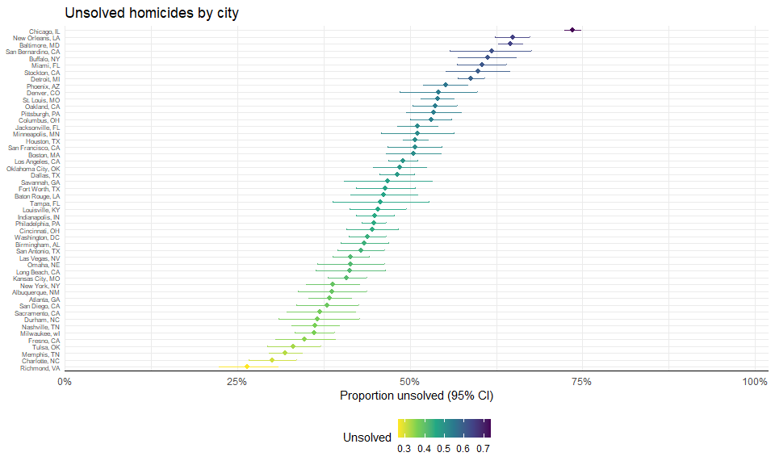

P8105_HW5_rs4788
================

## Problem 1

### First, creat a function:

``` r
duplicate_birth = 
  function(n, days = 365) {
  if (!is.numeric(n) || length(n) != 1 || n <= 0 || n != as.integer(n)) {
    stop
  }
  if (!is.numeric(days) || length(days) != 1 || days <= 1 || days != as.integer(days)) {
    stop
  }
  
  bdays = sample.int(days, size = n, replace = TRUE)
  any(duplicated(bdays))
}
```

### Then, make a plot:

``` r
set.seed(8105)
ns = 2:50
B  = 10000

prob =
  tibble(n = ns) %>%
  mutate(p_shared = purrr::map_dbl(n, ~ mean(replicate(B, duplicate_birth(.x)))))

prob
```

    ## # A tibble: 49 × 2
    ##        n p_shared
    ##    <int>    <dbl>
    ##  1     2   0.0024
    ##  2     3   0.007 
    ##  3     4   0.0173
    ##  4     5   0.0258
    ##  5     6   0.0378
    ##  6     7   0.0539
    ##  7     8   0.0755
    ##  8     9   0.0925
    ##  9    10   0.121 
    ## 10    11   0.138 
    ## # ℹ 39 more rows

``` r
ggplot(prob, aes(x = n, y = p_shared)) +
  geom_line(linewidth = 0.5, color = "#0072B2") +
  geom_point(size = 1.2, color = "#0072B2", alpha = 0.85) +
  geom_hline(yintercept = 0.5, linetype = "dashed") +
  scale_y_continuous(labels = percent_format(accuracy = 1)) +
  labs(
    title = "Probability of at least two people share birthday",
    x = "Group size (n)",
    y = "Probability"
  ) +
  theme_minimal()
```



The probability that at least two people in the group share a birthday
by averaging across the 10000 simulation increases rapidly with the
group size n. When n is approximately 23, the probability reaches 50%,
and when n is 50, the probability has already reached approximately 95%.

## Problem 2

### Let’s do a t-test:

``` r
set.seed(8105)
n = 30
sigma = 5
B = 5000

ttest = function(mu) {
  x = rnorm(n, mean = mu, sd = sigma)
  t.test(x, mu = 0) %>% 
    tidy() %>%
    transmute(mean_value = estimate, p_value = p.value)
}

ttest_u0 =
  tibble(run = 1:B) %>%
  mutate(out = purrr::map(run, ~ ttest(mu = 0))) %>%
  unnest(out)

type1_error = mean(ttest_u0$p_value < 0.05)
```

### Reapeated and make plots:

``` r
mu_grid = 1:6

power_result =
  tibble(mu = rep(mu_grid, each = B)) %>%
  mutate(out = purrr::map(mu, ttest)) %>%
  unnest(out)

power_df =
  power_result %>%
  group_by(mu) %>%
  summarise(power = mean(p_value < 0.05), .groups = "drop")
power_df
```

    ## # A tibble: 6 × 2
    ##      mu power
    ##   <int> <dbl>
    ## 1     1 0.195
    ## 2     2 0.55 
    ## 3     3 0.879
    ## 4     4 0.991
    ## 5     5 0.999
    ## 6     6 1

``` r
power_df %>%
  ggplot(aes(x = mu, y = power)) +
  geom_line(linewidth = 0.6) +
  geom_point(size = 1.6) +
  scale_x_continuous(breaks = 1:6) +
  scale_y_continuous(limits = c(0, 1)) +
  labs(
    title = "Power of one-sample t-test (α = 0.05)",
    x = expression(mu), y = "Power"
  ) +
  theme_classic() 
```



The greater the μ value, which means the greater the effect size, the
higher the power, which increases monotonically and approaches 1. In
this simulation, when μ=1, the power is small, approximately 0.2; when μ
increases to 4, the power increases to approach 1.

``` r
all_result =
  bind_rows(
    ttest_u0 %>% mutate(mu = 0),
    power_result
  )


avg_all =
  all_result %>%
  group_by(mu) %>%
  summarise(mean_all = mean(mean_value), .groups = "drop")


avg_reject =
  all_result %>%
  filter(p_value < 0.05) %>%
  group_by(mu) %>%
  summarise(mean_reject = mean(mean_value), .groups = "drop")


plot_df = left_join(avg_all, avg_reject, by = "mu")
```

``` r
plot_df %>%
  ggplot(aes(x = mu)) +
  geom_line(aes(y = mean_all), linewidth = 0.6, color = "#0072B2") +
  geom_point(aes(y = mean_all), size = 1.6, color = "#0072B2") +
  geom_line(aes(y = mean_reject), linewidth = 0.6, linetype = "dashed", color = "firebrick") +
  geom_point(aes(y = mean_reject), size = 1.6, color = "firebrick") +
  geom_abline(slope = 1, intercept = 0, linetype = "dotted") +
  scale_x_continuous(breaks = 0:6) +
  labs(
    title = "Average estimate of μ vs true μ",
    subtitle = "Solid: all samples; Dashed: only rejections (p < 0.05); n = 30, σ = 5",
    x = expression(true~mu), y = expression(average~hat(mu))
  ) +
  theme_classic(base_size = 12)
```



The sample mean $\hat{\mu}$ across tests for which the null is rejected
does not exactly equal the true value of μ. Initially, $\hat{\mu}$ is
greater than the true μ, and only when μ reaches 4, the two values
become close.

This is because the sample mean $\hat{\mu}$ is unbiased for μ under
unconditional conditions. However, “considering only samples that reject
the null hypothesis” constitutes conditional selection, which induces
selection bias away from 0. Only when the true mean μ increases, the
power approaches 1, the conditional average $\hat{\mu}$ converges back
to μ.

## Problem 3

### Describe the raw data

``` r
homicide =
  read_csv("./data/homicide-data.csv") %>%
  janitor::clean_names()
```

    ## Rows: 52179 Columns: 12
    ## ── Column specification ────────────────────────────────────────────────────────
    ## Delimiter: ","
    ## chr (9): uid, victim_last, victim_first, victim_race, victim_age, victim_sex...
    ## dbl (3): reported_date, lat, lon
    ## 
    ## ℹ Use `spec()` to retrieve the full column specification for this data.
    ## ℹ Specify the column types or set `show_col_types = FALSE` to quiet this message.

``` r
city_sum =
  homicide %>%
  mutate(state = if_else(city == "Tulsa" & state == "AL", "OK", state)) %>%
  mutate(city_state = paste(city, state, sep = ", ")) %>%
  group_by(city_state) %>%
  summarise(
    n_homicides = n(),
    n_unsolved  = sum(disposition %in% c("Closed without arrest", "Open/No arrest")),
    .groups = "drop"
  ) %>%
  arrange(desc(n_unsolved))

city_sum
```

    ## # A tibble: 50 × 3
    ##    city_state       n_homicides n_unsolved
    ##    <chr>                  <int>      <int>
    ##  1 Chicago, IL             5535       4073
    ##  2 Baltimore, MD           2827       1825
    ##  3 Houston, TX             2942       1493
    ##  4 Detroit, MI             2519       1482
    ##  5 Philadelphia, PA        3037       1360
    ##  6 Los Angeles, CA         2257       1106
    ##  7 New Orleans, LA         1434        930
    ##  8 St. Louis, MO           1677        905
    ##  9 Dallas, TX              1567        754
    ## 10 Jacksonville, FL        1168        597
    ## # ℹ 40 more rows

This dataset contains homicide case data from 50 major U.S. cities,
including city and state, date, latitude/longitude, victim
characteristics, and case disposition. I merged the data to create a
city_state variable and aggregated it by city to derive two indicators:
the total number of homicides in each city and the number of unsolved
cases.

### Take a look at Baltimore

``` r
balt_counts =
  city_sum %>%
  filter(city_state == "Baltimore, MD") %>%
  select(n_unsolved, n_homicides)

balt_pt =
  prop.test(x = balt_counts$n_unsolved, n = balt_counts$n_homicides)

balt_result =
  balt_pt %>%
  tidy() %>%
  select(estimate, conf.low, conf.high)

balt_result
```

    ## # A tibble: 1 × 3
    ##   estimate conf.low conf.high
    ##      <dbl>    <dbl>     <dbl>
    ## 1    0.646    0.628     0.663

### All city statistic

``` r
city_result =
  city_sum %>%
  mutate(
    test = map2(n_unsolved, n_homicides, ~ prop.test(.x, .y)),
    tidy = map(test, tidy)
  ) %>%
  select(city_state, n_homicides, n_unsolved, tidy) %>%
  unnest(tidy) %>%
  transmute(
    city_state,
    n_homicides,
    n_unsolved,
    prop_unsolved = estimate,
    conf_low     = conf.low,
    conf_high    = conf.high
  ) %>%
  arrange(desc(prop_unsolved))

city_result
```

    ## # A tibble: 50 × 6
    ##    city_state         n_homicides n_unsolved prop_unsolved conf_low conf_high
    ##    <chr>                    <int>      <int>         <dbl>    <dbl>     <dbl>
    ##  1 Chicago, IL               5535       4073         0.736    0.724     0.747
    ##  2 New Orleans, LA           1434        930         0.649    0.623     0.673
    ##  3 Baltimore, MD             2827       1825         0.646    0.628     0.663
    ##  4 San Bernardino, CA         275        170         0.618    0.558     0.675
    ##  5 Buffalo, NY                521        319         0.612    0.569     0.654
    ##  6 Miami, FL                  744        450         0.605    0.569     0.640
    ##  7 Stockton, CA               444        266         0.599    0.552     0.645
    ##  8 Detroit, MI               2519       1482         0.588    0.569     0.608
    ##  9 Phoenix, AZ                914        504         0.551    0.518     0.584
    ## 10 Denver, CO                 312        169         0.542    0.485     0.598
    ## # ℹ 40 more rows

### Make a plot

``` r
city_result %>%
  mutate(city_state = forcats::fct_reorder(city_state, prop_unsolved)) %>%
  ggplot(aes(x = prop_unsolved, y = city_state, colour = prop_unsolved)) +
  geom_errorbarh(aes(xmin = conf_low, xmax = conf_high),
                 height = 0.15, size = 0.4, alpha = 0.9) +
  geom_point(size = 1.8) +
  scale_x_continuous(
    labels = scales::percent_format(accuracy = 1),
    limits = c(0, 1),
    expand = expansion(mult = c(0, .02))
  ) +
  scale_colour_viridis_c(direction = -1, guide = guide_colorbar(title = "Unsolved")) +
  labs(
    title = "Unsolved homicides by city",
    x = "Proportion unsolved (95% CI)", y = NULL
  ) +
  theme(
    axis.text.y = element_text(size = 6),
    axis.line.x = element_line(color = "black", linewidth = 0.3))
```



The unsolved homicides rates across 50 cities range from approximately
25% to 75%, with most cities falling between 40% and 60%. Chicago has
the highest unsolved rate at around 74%, while Richmond has the lowest
at approximately 26%.
